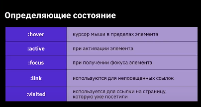
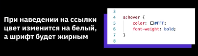
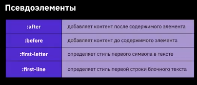
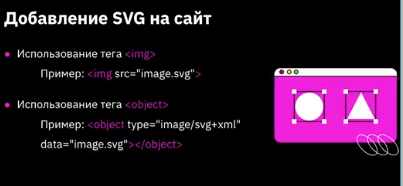
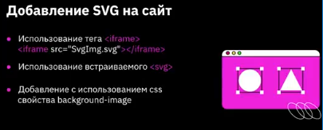

# Конспект по CSS

### I. Псевдоклассы и псевдоэлементы

**Псевдоклассы** - это атрибуты, назначаемые строго к селекторам с намерением определить реакцию или состояние для данного селектора.

 

 

 ### Добавление стилей к дочерним элементам

```html
<div class="parent">
    <div class="child"></div>
</div>
```

```css
.parent:hover .child {
    background-color: blue;
}
```
При наведении на блок с классом "parent" у дочернего элемента с классом "child" цвет фона изменился на синий.




### Преимущества SVG

- При масштабировании SVG не теряет в качестве, увеличивается скорость загрузки сайта из-за уменьшения HTTP-запросов.
- При использовании CSS можно менять параметры графики на сайте, например, фон, прозрачность или границы.
- С использованием JavaScript можно анимировать SVG.
- Минимальный размер файла формата SVG.






### Эффекты перехода

#### Свойство Transition и его особенности

- Переходы осуществляют плавные переходы при смене одного значения свойства на другое.
- Часто используется для стилизации эффектов наведения или анимации элемента.
- Также дают возможность контролировать плавность CSS-свойств при анимации элементов.

#### transition-property

Название свойства, к которому будет применяться эффект трансформации.

#### transition-duration
Промежуток времени, за которое происходит изменение элемента.

#### transition-timing-function
Функция, определяющая скорость перехода объекта из одного состояния в другое.

#### transition-delay
Изменение происходит не сразу, а по истечении времени (необязательное свойство).

### Свойство tramsform

- **translate(x,y):** Смещает элемент относительно его положения, исввпользуя указанные значения x, y.
-  **scale(x,y):** Даст возможность изменить масштаб элемента, первое значение отвечает за изменение по ширине, второе по высоте.
-  **rotate(deg):** Поворот элемента на указанное значение градусов, возможно указать отрицательные значения и на несколько оборотов.
-  **skew(x-deg, y-deg):** Искажение сторон элемента относительно координатной оси, возможно указать только одно значение, второе будет рассчитано автоматически.

### Свойство animation и его особенности

- С помощью анимации можно оживить веб-страницы.
- Добавить обратную связь с пользователем, эмоциональность и индивидуальность.
- Анимация применяется к любым html-элементам, а также к псевдоклассам.

**свойства:**

- animation: Позволяет задать все значения для настройки выполнения анимации за одно определение.
