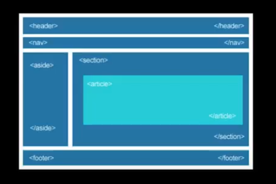

# Новые возможности HTML5

### Введение:

**HTML5:** Последняя основная версия HTML, расширяющая возможности веб-разработки. Улучшенная семантика, новые API, поддержка мультимедиа и больше.

**Цель:** Создание более интерактивных, функциональных и доступных веб-приложений.

### Новый способ структурирования страниц

**I. Для чего необходим новый способ структурирования страниц?**

1. Более удобное редактирование и сопровождение.
2. Оптимизация поисковых движков.
3. Поддержка будущих возможностей.

### Семантические элементы для работы со структурой страниц

**I. `<header>`** : Шапка сайта или раздела, в которой может располагаться один или несколько заголовков, группа навигационных цепочек, информация об авторе.

**II. `<main>`** : Основное, уникальное для каждой страницы, содержимое сайта.

**III. `<footer>`** : Подвал сайта или раздела, где может содержаться информация об авторе, навигационная цепоска или контактная информация.

**IV. `<section>`** : Логическая область страницы, применяется для новостей, блоков информации. Раздел чаще всего содержит заголовок. 

**V. `<article>`** : Раздел контента, который образует независимую часть документа или сайта, например, статья в журнале, запись в блоге, комментарий.

**VI. `<aside>`** : Контент страницы, который можно убрать со страницы без потери смысла для сайта.

**VII. `<figure>`** : Тег-контейнер для иллюстрации или диаграммы, обычно с подписью `<figcaption>`. 

**VIII. `
`** : Виджет, который пользователь может открыть или закрыть.

**IX. `
`** : В этот тег заключается текст, который необходимо скрыть.

**X. `<time>`** : Определяет дату, время, например для выделения даты создания статьи или контента, регистрация на сайте.

**XI. `<wbr>`** : Место разрыва длинной строки.

### Устройство сайта

## Усовершенствование традиционных форм

### Модернизация стандартной HTML формы

- Добавление подсказок
- Фокусировка на элементе
- Проверка ошибок
- Добавление даты
- Создание поле имейла или числа

